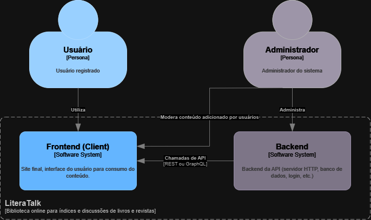

# Diagrama de Contexto

Em um resumo básico, a aplicação consistirá de dois grupos ("servicços", apesar de não serem serviços tecnicamente) com dois tipos básicos de usuários:
- Usuário comum, que pode se registrar no site e adicionar certos tipos de conteúdo, como livros, guias pessoais, ou opiniões sobre determinado conteúdo.
- Administrador, que possui um acesso avançado ao site, podendo realizar não somente as coisas que um Usuário Comum pode fazer, mas também tendo acesso ao banco de dados, além de poder deletar e atualizar conteúdo, e também moderar.

[Retorna](../README.md)
